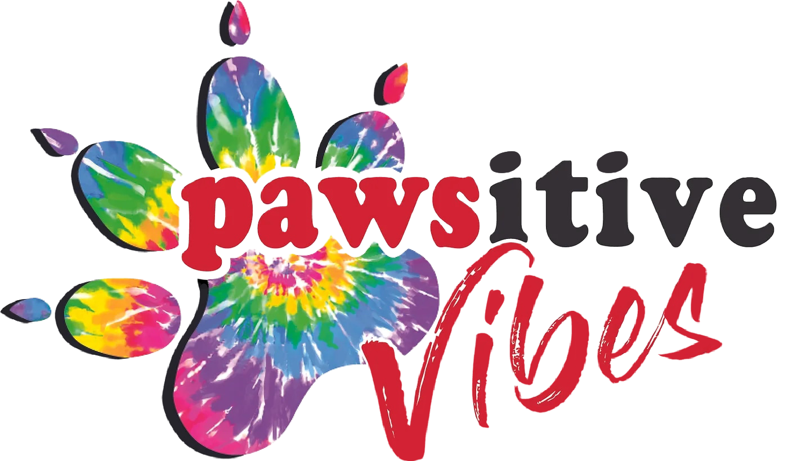
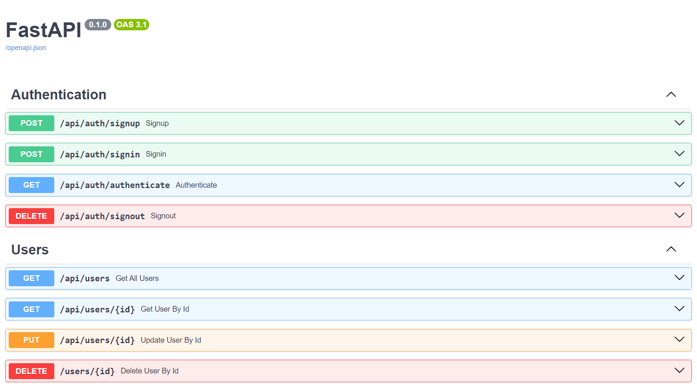

# Pawsitive Vibes Dog Training Co.



### Welcome to our Pawsitive Community!

At Pawsitive Vibes, we believe in fostering connections, celebrating diversity, and creating a safe space for all pet enthusiasts. Whether you're a seasoned pet owner or considering bringing a furry friend into your life, you've come to the right place.

## Project Team

-   Kyle McPeake
-   Austin Hamilton
-   James Keyser
-   Grace Lee

## Design

-   [Demo](./docs/DEMO.md)
-   [API](./docs/API.md)
-   [Data Schema](./docs/DATASCHEMA.md)
-   [GHI](./docs/GHI.md)
-   [3rd Party Integrations](./docs/INTEGRATIONS.md)

## Market

Pawsitive Vibes Dog Training Co. aims to serve clients and their precious dog companions through a variety of training services and community events. We aim to design an informative, user-friendly business platform both to drive sales for the independent business owner and provide excellent customer satisfaction.

## Functionality

### Visitors

-   Visitors can view the website home page, pets page, services page, and meet ups page without having to create an account.
-   Visitors may also submit a Contact Form with their information to send a message to the business and start an email conversation. This service is provided through EmailJS.
-   Vistors may sign up and sign in as a user to view pages only accessible to users.

### Users

Users can enjoy additional functionality:

-   Users may submit a testimonial, which will be reviewed and approved by the admin for display on the main home page.
-   Users may Request an Appointment on the Services page, which will redirect them to the Calendly API for the business.
-   Users may update their Profile with a profile picture and bio description; they may also update their name.
-   Users may add their pets to be displayed on their profile and on the Pets page under Community Pets.

### Admins

Admins are granted additional administrative functionality:

-   Admins may manage testimonials to approve them to be displayed on the Home page or delete them if needed.
-   Admins may also submit a testimonial if they want to manually add feedback they've received in other correspondence.
-   Admins can add dogs to be listed for sale on the pets page. They may also edit or remove any pets.
-   Admins may add new services using the Services Form, which will then be displayed on the Services page.
-   Admins can also edit or remove these services.
-   Admins can add MeetUps to be displayed on the Meetups page. They can add and remove them as needed.

## Project Set Up

1. Clone the repository to your local machine.

```
git clone https://gitlab.com/pawsitive-vibes/pawsitive-vibes.git
```

2. Open the new project directory.

```
cd pawsitive-vibes
```

3. Create two .env files.

    - the first .env file will be inside the root-directory of 'pawsitive-vibes'

        - inside, you will need to add these variables.
        - you can set your own username, password, and signing key.
        - keep the database name as 'database_volume'

        ```
        POSTGRES_DB="database_volume"
        POSTGRES_USER="your-username"
        POSTGRES_PASSWORD="your-password"
        SIGNING_KEY="your-signing-key"

        ```

    - the second .env file will be inside the ghi directory.

        - this is a separate file from the first .env file.
        - inside, you will list your third party API keys.
        - for the purpose of this project, we have provided temporary keys,
          but these will be changed in the future for security measures.
        - PUBLIC_KEY, TEMPLATE_ID, SERVICE_ID, and PV_EMAIL are used for the EmailJS services.
        - the google-maps-api-key is linked to your personal gmail account,
          and is only available for business accounts that have a linked credit card.
          as such, this is the onyl key not provided in this project demonstration.

        ```
         VITE_PUBLIC_KEY="public_key"
         VITE_TEMPLATE_ID="contact_form"
         VITE_SERVICE_ID="service_id"
         VITE_PV_EMAIL = 'business_email'
         VITE_GOOGLE_MAPS_API_KEY = 'google-maps-api-key'
        ```

4. Create the docker database volume.

```
docker volume create database_volume
```

5. Build the docker containers.

```
docker compose build
```

6. Run the docker containers. Make sure all the containers are running.

```
docker compose up
```

7. Access the web app at: http://localhost:5173/
   
8. Access the web docs at: http://localhost:8000/docs
   
