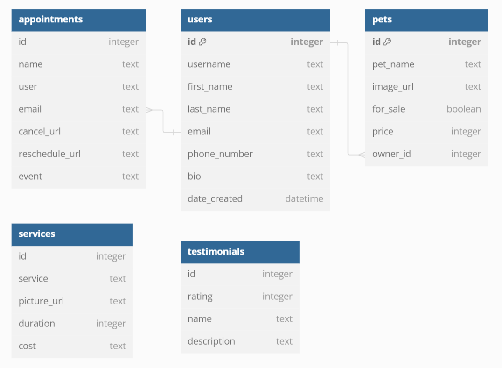

#### Grace's Development Journal

## 4.12.2024

Set Up Day

-   Our group successfully worked on our wireframe diagrams and discussed API endpoints.
-   Our group successfully set up our GitLab repositories and downloaded our project base.

-   Our group successfully worked on our wireframe diagrams and discussed API endpoints.
-   Our group successfully set up our GitLab repositories and downloaded our project base.

## 4.15.2024

Today I worked on:

Understanding the various components of our project. I'm trying to understand how to implement a SQL database and table relations. I created the directory data, and inside created a Dockerfile.dev with commands to load the sql file to the Docker database when Docker runs. The dogs.sql file was also created to hold the SQL code that sets up the data types and table structures for our PostgreSQL database. I set up the basic table structure for the various endpoints we will be working with, but the Appointments table will largely be a work-in-progress depending on how we decide to structure the third party API data.

## 4.16.2024

Today I worked on:

Our group is creating issues and assigning them, with the goal of creating 1 table with migrations this week and completing 1 set of endpoints for our models. I created a few issues that we can reference as we create merge requests. I took the sample data tables created in dogs.sql and transferred them to knew .py files in the directory api/migrations.

Then I worked on creating a pets.py in the directory models, with a pet_queries.py file in the directory queries. The pet_queries.py file contains the various CRUD class functions to create, update, delete, and get a pet(s). I also created the pets_routers.py that so far has one get function defined. I have yet to test these functions yet, but I will work more on that tomorrow.

## 4.17.2024

Today I worked on:

I noticed that my FastAPI docs page was not loading, and found out that it was due to errors in how I've set up my routers. I was able to go back and correctly create endpoints for the model pets. Afterwards, the FastAPI docs page was working properly. I modified my PetQueries repository to return Falsy values instead of an error message, so that the error messages would instead be displayed on the router portion of the app. For error handling, I referenced the user_router.py and decided to use the HTTPException status codes and messages.

## 4.18.2024

Today I worked on:

I completed the SQL Database table showing the relations between our data tables. The users, pets, and appointments tables have relationships, while the services and testimonials tables do not.

Our group split up endpoints to work on. I've already finished all of the pets endpoints for models, queries, and routers; Kyle will be working on the users endpoints, Austin will be working on the services endpoints, and James will be working on the testimonials endpoints. We are hoping to set up our React front-end so we can start testing our database set up.

## 4.20.2024

Today I worked on:

I created the base template for an index.js to create a root for our app, and also created a base template for App.js. I created a folder to hold the base App.js that came with the project files, in case we need to reference anything from it. I'm hoping and planning to modify some Bootstrap HTML formatting to create basic form templates for our various forms, before we also adjust the design to match our client's needs. I have yet to get to it, but I've looked through more of the project files and found that the app favicon icon is decided by the index.html file. Eventually, I hope to re-create a paw icon from the client's logo to be used as the favicon for a more professional business look.

## 4.22.2024
